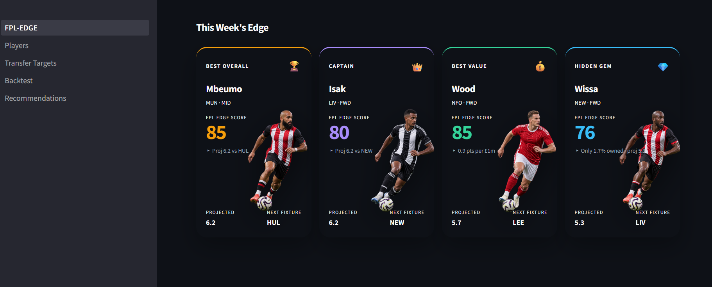
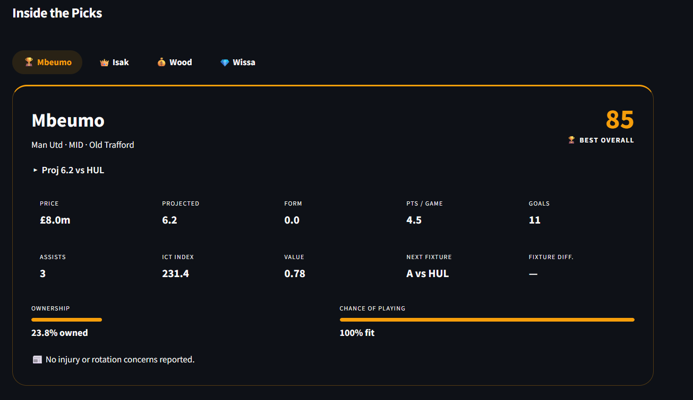
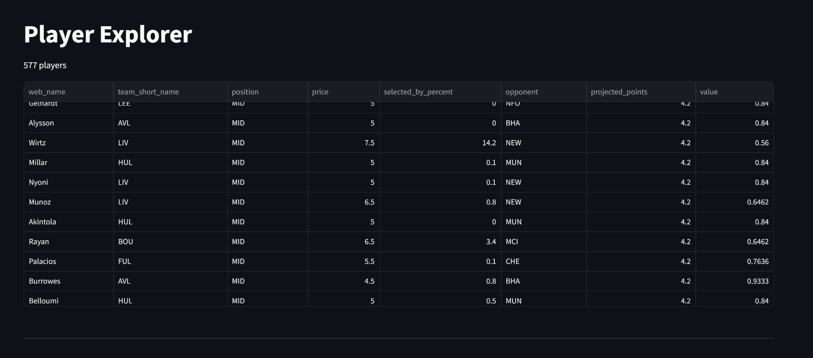
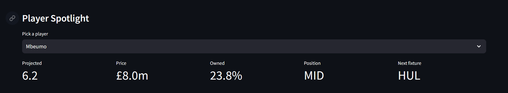
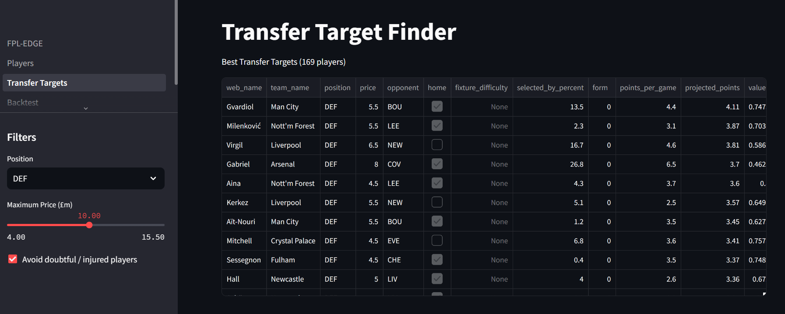
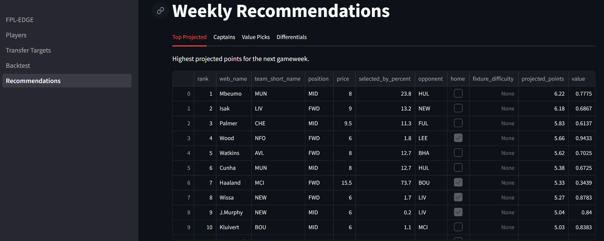
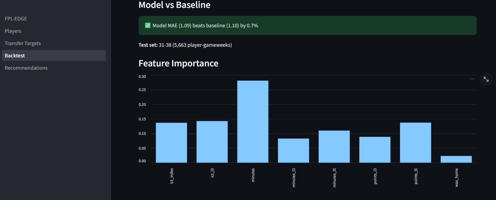

# FPL Edge — See the Edge. Make the Move.

An open-source decision engine that turns Fantasy Premier League data into four weekly
actions — **Best Overall, Captain, Best Value, Hidden Gem** — each with a 0–100 Edge
Score, a fixture-adjusted projection, and a plain-language reason.

### 🏠 Home — Hero Decision Cards & Dossiers



### 🎯 Players



### 🎯 Transfer Target Finder


###  Weekly Recommendations


### 🧪 Model Backtest


## 🎯 The Problem
FPL managers drown in statistics but starve for decisions. Form, fixtures, ownership
and injury news live in different places and never combine into a clear "do this".

## ⚡ The Solution
FPL Edge fuses the official FPL API with a full 2024-25 gameweek archive and outputs
exactly four decisions per gameweek, explained in plain language, in an interactive
dashboard.

## ✨ Features
- Hero decision cards with Edge Scores, reasons, AI player art + silhouette fallback
- Sliding player dossiers (team, stadium, fixtures, injury news)
- Player Explorer with search, filters and spotlight
- Transfer Target Finder with injury-avoidance
- Recommendation lists: top projected / captains / value / differentials
- Model Backtest page with held-out evaluation vs baseline

## 🧠 Methodology
- **Projections:** 2024-25 points-per-90 priors, dampened by √(minutes share),
  multiplied by availability and fixture adjustment
- **Edge Scores:** percentile composites of projection, value, ownership, ceiling
- **Model:** RandomForest on lagged rolling features (no lookahead), trained GW1-30,
  evaluated GW31-38; xP excluded per the archive's lookahead-bias warning
- **Backtest:** MAE, RMSE, Spearman rank correlation, captain hit-rate vs baseline
  and vs random chance (~1.7%)

## 📊 Data
- Official FPL API (bootstrap-static, fixtures)
- Historical gameweeks: [vaastav/Fantasy-Premier-League](https://github.com/vaastav/Fantasy-Premier-League) — thank you!

## 🚀 Run Locally
```bash
python -m venv .venv && .venv\Scripts\activate
pip install -r requirements.txt
run.bat
```

## 🗂️ Structure
```text
app/            Streamlit app (home + 4 pages, components, styles, assets)
scripts/        fetch → build → recommend → evaluate pipeline
notebooks/      model exploration
data/           raw (gitignored) + processed (committed)
models/         metrics + feature importance (joblib gitignored)
```

## ⚖️ Limitations
Pre-season projections use last-season priors (documented by design); single-season
training; no live refresh yet — all on the v2 roadmap.

## 📄 License
MIT 
